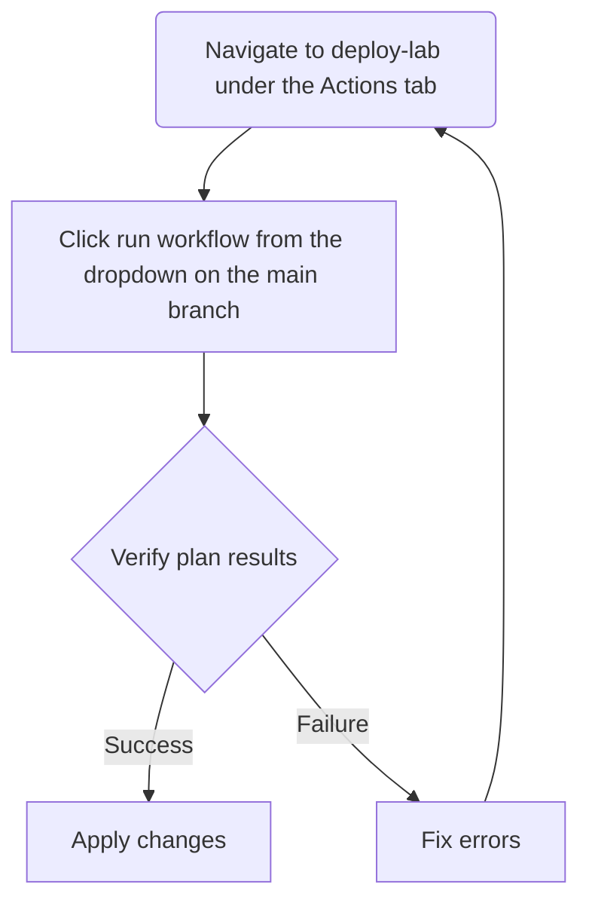
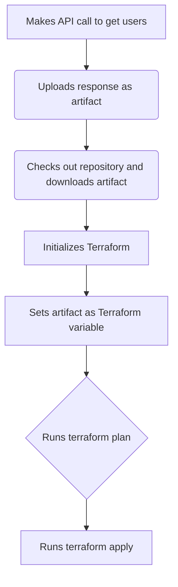

# zanarkand

## This is a POC of an Azure DevTest Lab environment management
This pipeline is configured using GitHub Actions and Terraform Cloud to manage the DevTest Lab and user virtual machines in the lab environment. The `backend.tf` file does contain the workspace that deploys the Terraform, though it should never be triggered from the UI.

### GitHub Action
There is a GitHub Action that manages the deployment.

### GitHub Workflow
The workflow itself does the following:

---
### Terraform Workspace
The workspace is used to manage state and deployments and is triggered from the GitHub Workflow. There should be no reason to interact with the workspace UI itself except to confirm success or failure.

There is a dummy file, `users.json` contained in the repo that gets overwritten in the pipeline.